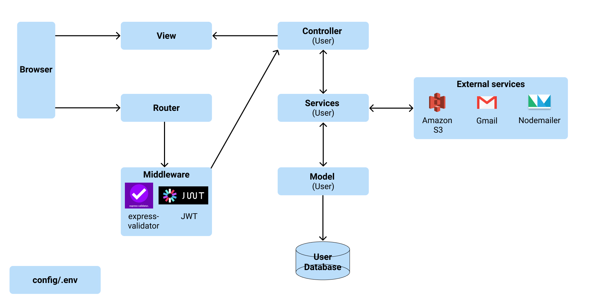
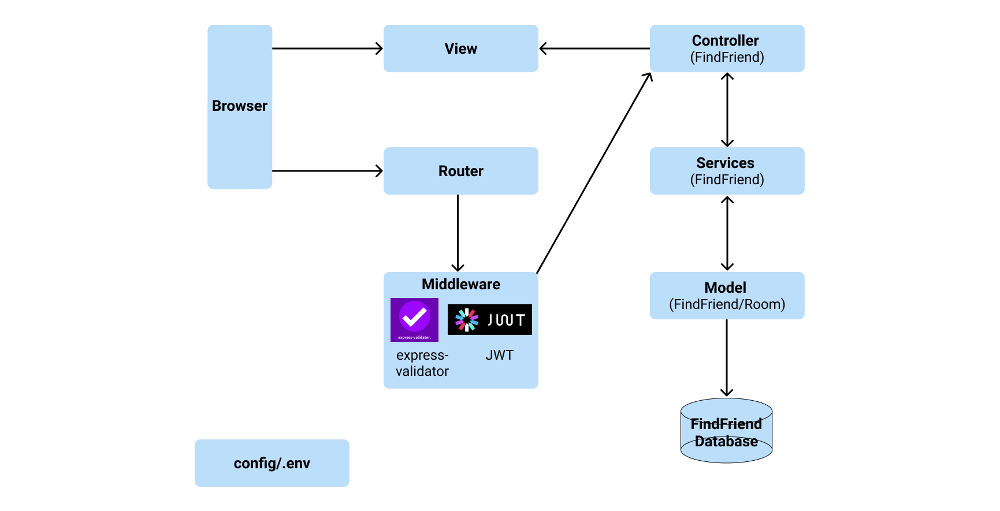
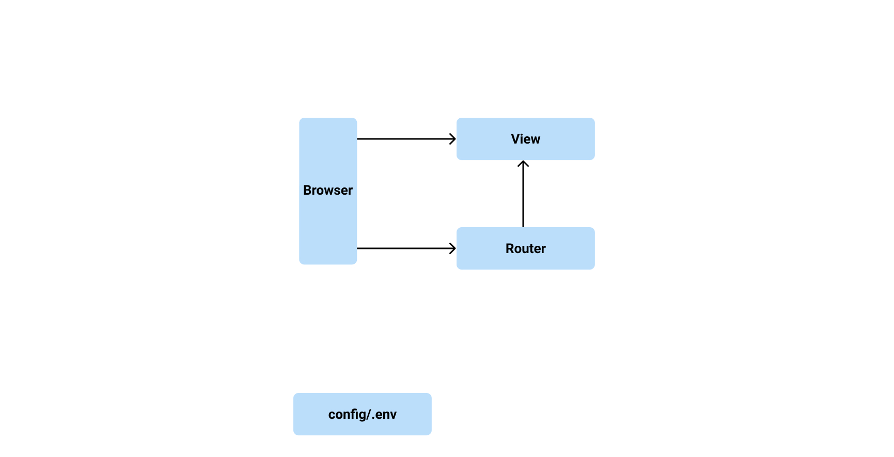

# Backend Microservices

For the backend architecture, we have decided to adopt microservices architecture where the NUSociaLife application is a collection of microservices (Users, FindFriend, Forum and Chat). This ensures that the microservices are highly maintainable and testable, loosely coupled with high cohesion, independently deployable and developable.

Within each microservice, we have implemented an architecture style that is inspired by the MVC model. The internal structure of each microservice is split into different parts (model, view, controller, middlewares, router, services) which follows closely to the MVC model. The user will first invoke an action which will be directed to the controllers, the controller then updates the model as per user actions and then the model will trigger the view (routes) to update.

## Users Microservice

## FindFriend Microservice

## Forum Microservice

## Chat Microservice

