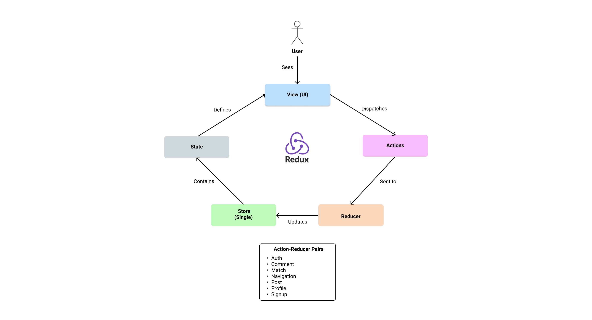

# Frontend Monolith

Micro-Frontends are great for large projects but can be slower and complicated for small and medium sized projects, working off the same standards is challenging for developers. For example, the design of the Frontend should stay consistent across the Micro-Frontends. A very high level of coordination is required to manage the consistency of the different micro frontends.

Since our application is considered a small/medium sized project, we felt that a single Frontend codebase is easier to set up and to work on. This allows us to put more focus into developing the features, ensuring code quality and keeping our designs consistent within the codebase.

## Frontend Architecture

## Redux Architecture

We used Redux to reduce the complexity of passing around props into nested components. This gives us a cleaner codebase, and separates our business logic from our UI codes.

We set up the store using the Redux Persist library, which uses the localStorage for web applications. This allows us to store our Authentication token hashed by the Backend, into the Auth redux state. Subsequent API calls from our Frontend will retrieve this Auth Token to make API calls to the Backend.

